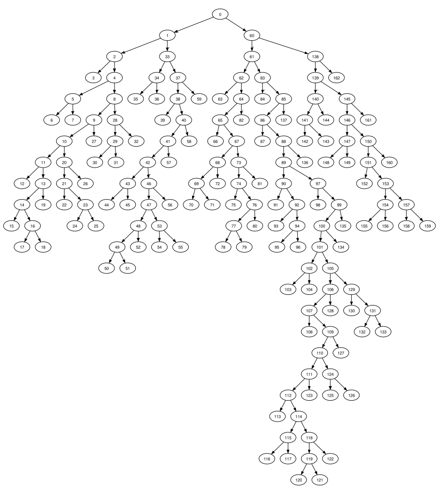

# liman
an utility to compress and decompress files based on [huffman
encoding](https://en.wikipedia.org/wiki/Huffman_coding) (lossless compression)

## Como rodar
```bash
# clone this repo
git clone https://github.com/cdavieira/liman.git

# cd to the directory where this project can be found
cd path/to/this/project

# make all executables
make

# compress a file: ./huffman /path/to/file
./huffman ./tests/pikachu.gif

# decompress a file: ./huffman /path/to/compfile
./unhuffman ./pikachu.gif.comp

# clean up all build objects
make clean

# get information about a .comp file
## information about the header
./huhman ./pikachu.gif.comp -h
## information about the body
./huhman ./pikachu.gif.comp -b
## creates 'huhman-pikachu.gif.comp.txt': all codes used to encode each byte of the file
./huhman ./pikachu.gif.comp -c
## creates 'huhman-pikachu.gif.comp.dot': a dot file, which can then be parsed by tools to visualize the huffman tree!
./huhman ./pikachu.gif.comp -p
# in case 'dot' is installed, a pdf can be generated like so:
# dot -Tpdf ./pikachu.gif.comp.dot -o ./huffman.pdf
```

## Do algoritmo de Huffman
O **algoritmo de Huffman** funciona recodificando códigos comumente usados para
codificar caracteres.

A exemplo da representação ASCII estendida, essa codifica 256 caracteres usando
8 bits por caracter. Portanto, se um arquivo de texto chamado `senha.txt`
contém 4 caracteres, ao todo seu tamanho é 32 bits.

O **algoritmo de Huffman** atua na **redução do número de bits por caracter**,
de forma a criar códigos que utilizam menos bits do que o usual para codificar
caracteres.

Assim, em vez dos usuais 8 bits por caracter, por vezes o algoritmo de
Huffmann permite que sejam utilizados apenas 4/5/6 bits para armazenar 1
caracter, o que reduz consideravelmente o tamanho total de alguns tipos de
arquivo.

## Dos arquivos `.comp` gerados
Quanto aos arquivos `.comp` gerados pelo programa, esses são arquivos
*binários*, sendo que o formato com que são escritos é o seguinte:

`<header><1 byte><body>`

Onde:
1. `header`: tabela de huffman em formato de árvore
2. `1 byte`: o numero de bits de padding que foram adicionados ao final do arquivo
3. `body`: mensagem codificada segundo tabela de huffman

A descompressão dos arquivos `.comp` basicamente segue 2 passos:
1. remontar a *tabela de huffman*
2. ler a mensagem em binário e trocar o *código de huffman* pelo seu
   correspondente ASCII estendido

> A compactação via *algoritmo de Huffman*, ainda que sem perda, não é tão
> eficiente quanto outras existentes.

> tl;dr: em geral, quanto mais vezes alguns dos caracteres de uma codificação
> de caracteres se repetem em um texto, mais eficiente se torna o algoritmo de
> Huffmann.

## Da arvore de huffman
Basicamente corresponde a uma estrutura em arvore que permite
gerar códigos únicos e não ambíguos para codificar bytes.

O bacana é que essas podem ser visualizadas! Aqui esta uma das árvores de
huffman produzidas pelo liman para o teste 'bible.txt':


> imagem gerada usando o './huhman' e o programa 'dot'

## Desempenho de compactação
O projeto contem alguns arquivos na pasta `tests`, que foram usados para testar
o desempenho da compactação para diferentes tipos de arquivo.

  input     | extensao | tamanho original  |  tamanho compactado  | taxa de compressão  |
:------:    | :------: |:----------------: | :------------------: | :----------------:  | 
bible.txt   |   txt    |  4_451_368 bytes  |    2_577_871 bytes   |       +42.09%       |
teste.txt   |   txt    |  97_042 bytes     |    79_228 bytes      |       +18.36%       |
pikachu.gif |   gif    |  4_459_259 bytes  |    4_449_597 bytes   |       +00.22%       |
gatinhu.png |   png    |  160_039 bytes    |    160_363 bytes     |       -00.20%       |
jpg.jpg     |   jpg    |  35_989 bytes     |    36_033 bytes      |       -00.12%       |

## Discussões

A estratégia de compactação proposta pelo algoritmo de Hufmann nem sempre é
eficiente.  Pela forma como funciona, essa se torna mais proveitosa para
textos/arquivos que utilizam caracteres que se repetem com muita frequência e
que utilizam um número restrito de letras de um alfabeto.

A exemplo dos textos escritos em ingles, esses geralmente utilizam 26 (letras
minusculas) + 26 (letras maiusculas) + 10 (digitos) + 2 (\n e \b) caracteres,
totalizando 64 caracteres. Nesse sentido, 64 dos 256 caracteres previstos pela
representação ASCII estendida são em geral usados, sendo esse o cenário
predileto para a aplicação do *algoritmo de Huffman* (salvo algumas exceções).
Essa percepção se confirma pelas boas taxas de compactação dos arquivos `.txt`
testados.

É notório, ainda, que alguns arquivos de extensões como `.png`, `.jpg`, `.gif`
não apresentam taxas de compressão consideráveis e, algumas vezes, na verdade
sofrem um efeito contrário àquele esperado de uma compressão de arquivos.

Isso ocorre porque esses arquivos utilizam praticamente todos os caracteres da
tabela ASCII estendida na codificação da informação ali presente. Para
esses arquivos, outros tipos de compactadores são necessários para armazenar a
informação de forma eficiente e sem perdas.

> E por que raios liman? linux + huffman :P
