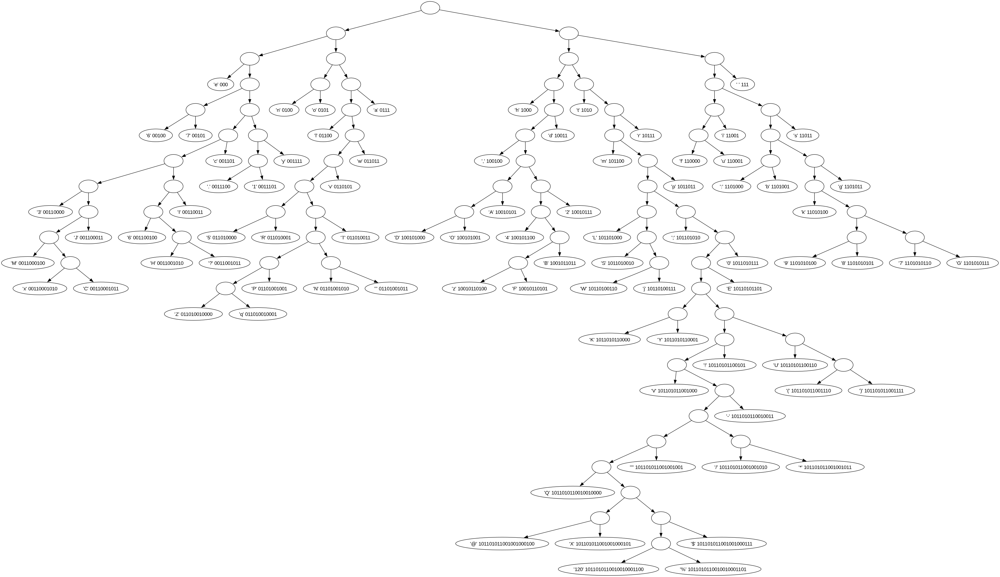

# liman
compress and decompress files based on [huffman
encoding](https://en.wikipedia.org/wiki/Huffman_coding) (lossless compression)

runs natively in POSIX-compatible OS's (not Windows)

> Windows might be able to compile/run it when using MinGW or another
compatibility layer

this is a project meant for learning purposes only.

## How to compile/run
```bash
# clone this repo
git clone https://github.com/cdavieira/liman.git

# cd to the directory where this project can be found
cd path/to/this/project

# compile liman
make

# compress a file: ./huffman /path/to/file
./liman -i ./tests/pikachu.gif

# decompress a file: ./huffman /path/to/compfile
./liman decompress -i ./pikachu.gif.comp

# clean up all build objects
make clean

# get information about a .comp file
## information about the header
./liman inspect -r -i pikachu.gif.comp
## information about the body
./liman inspect -b -i pikachu.gif.comp
## creates 'huhman-pikachu.gif.comp.txt': all codes used to encode each byte of the file
./liman inspect -c -i pikachu.gif.comp
## creates 'huhman-pikachu.gif.comp.dot': a dot file, which can then be parsed by tools to visualize the huffman tree!
./liman inspect -p -i pikachu.gif.comp
# in case 'dot' is installed, a pdf can be generated like so:
# dot -Tpdf ./pikachu.gif.comp.dot -o ./huffman.pdf
```

## Folder structure
```
.
├── assets
├── lib
│   ├── app
│   ├── core
│   │   └── fileformat
│   ├── platform
│   │   └── posix
│   └── utils
│       ├── container
│       └── types
├── src
│   ├── app
│   ├── core
│   │   └── fileformat
│   ├── platform
│   │   └── posix
│   └── utils
│       ├── container
│       └── types
└── tests
```

* src/app:             graphical/commandline interfaces to liman
* src/core:            liman core algorithmic logic for compression/decompression
* src/core/fileformat: liman core logic for reading/writing the .comp file
* src/platform:        system code
* src/platform/posix:  POSIX-compatible dependent code
* src/utils:           utility functions
* src/utils/types:     utility types
* src/utils/container: generic datatype containers
* assets:              figures used in this README
* tests:               files used as test for compression/decompression

## About the Huffman algorithm
The **Huffman algorithm** works by recoding commonly used codes to
encode characters.

For example, the extended ASCII representation encodes 256 characters using
8 bits per character. Therefore, if a text file called `senha.txt`
contains 4 characters, its total size is 32 bits.

The **Huffman algorithm** works by **reducing the number of bits per character**,
in order to create codes that use fewer bits than usual to encode
characters.

Thus, instead of the usual 8 bits per character, sometimes the
Huffman algorithm allows the use of only 4/5/6 bits to store 1
character, which considerably reduces the total size of some types of
files.

## About the generated `.comp` files
Regarding the `.comp` files generated by the program, these are
*binary* files, and the format in which they are written is as follows:

`<header><1 byte><body>`

Where:
1. `header`: Huffman table in tree format
2. `1 byte`: the number of padding bits that were added at the end of the file
3. `body`: message encoded according to the Huffman table

The decompression of `.comp` files basically follows 2 steps:
1. rebuild the *Huffman table*
2. read the message in binary and replace the *Huffman code* with its
   corresponding extended ASCII value

> Compression via the *Huffman algorithm*, although lossless, is not as
> efficient as other existing methods.

> tl;dr: in general, the more frequently some characters of a character
> encoding repeat in a text, the more efficient the Huffman
> algorithm becomes.

## About the Huffman tree
It basically corresponds to a tree structure that allows
the generation of unique and unambiguous codes to encode bytes.

The cool part is that these can be visualized! Here is one of the
Huffman trees produced by liman for the test 'bible.txt':


> image generated using './huhman' and the program 'dot'

## Compression performance
The project contains some files in the `tests` folder, which were used to test
compression performance for different types of files.

  input     | extension | original size     |  compressed size     | compression rate    |
:------:    | :------:  |:----------------: | :------------------: | :----------------:  | 
bible.txt   |   txt     |  4_451_368 bytes  |    2_577_867 bytes   |       +42.09%       |
teste.txt   |   txt     |  97_042 bytes     |    79_207 bytes      |       +18.36%       |
pikachu.gif |   gif     |  4_459_259 bytes  |    4_449_596 bytes   |       +00.22%       |
gatinhu.png |   png     |  160_039 bytes    |    160_362 bytes     |       -00.20%       |
jpg.jpg     |   jpg     |  35_989 bytes     |    36_032 bytes      |       -00.12%       |

## Discussions

The compression strategy proposed by the Huffman algorithm is not always
efficient. Due to how it works, it becomes more advantageous for
texts/files that use characters which repeat very frequently and
that use a restricted number of letters from an alphabet.

For example, texts written in English generally use 26 (lowercase
letters) + 26 (uppercase letters) + 10 (digits) + 2 (\n and \b) characters,
totaling 64 characters. In this sense, 64 of the 256 characters provided by the
extended ASCII representation are generally used, making this the
preferred scenario for applying the *Huffman algorithm* (with some exceptions).
This observation is confirmed by the good compression rates of the tested `.txt`
files.

It is also notable that some files with extensions such as `.png`, `.jpg`, `.gif`
do not present considerable compression rates and, sometimes, actually
experience the opposite effect of what is expected from file compression.

This occurs because these files use practically all characters from the
extended ASCII table in encoding the information contained within them. For
such files, other types of compressors are necessary to store the
information efficiently and without loss.

> And why the heck liman? linux + huffman :P
